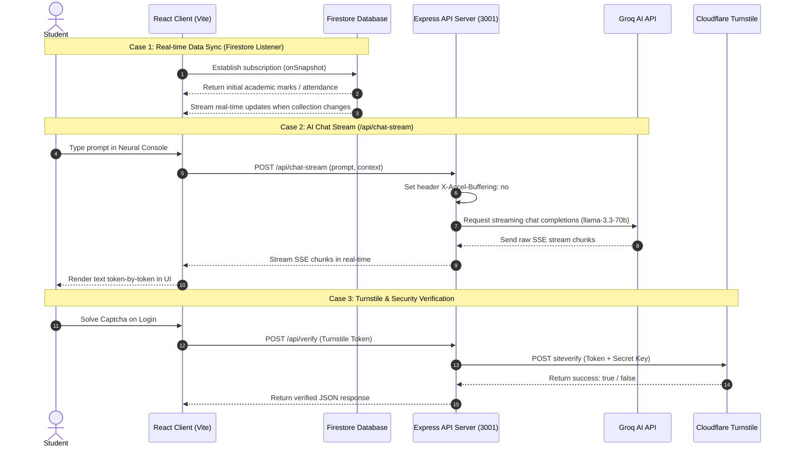

# APIS AI Architecture & Request Lifecycle

This document provides a deep dive into the engineering principles, structural design, and request lifecycle of the Academic Performance Intelligence System (APIS).

---

## 🏗 System Design Pillars

### 1. Offline-First Resilience (IndexedDB + Service Worker)
APIS AI utilizes a local persistence layer to ensure data availability even during total network failure.
- **Persistence**: Firebase `persistentLocalCache` with `persistentMultipleTabManager` ensures synchronization across all open browser tabs.
- **Service Worker**: Manages asset caching for instant startup and offline readiness.

### 2. Secure Intelligence Infrastructure (Gemini + Turnstile)
The AI and security integrations use a **Hybrid Secure Layer** to prevent client-side exposure of privileged keys.
- **Secure Proxy**: A dedicated `/api/ai` serverless function handles Gemini/Groq synthesis, ensuring the `GROQ_API_KEY` remains strictly server-side.
- **Identity Verification**: Turnstile tokens are verified via `/api/verify` before critical auth operations, protecting the `TURNSTILE_SECRET_KEY`.

### 3. Telemetry & Observability
Inspired by modern SRE practices, the platform monitors its own health.
- **Events**: Every critical interaction (backup, sync, failure) is logged via `telemetryService.ts`.
- **Latency Monitoring**: We track Firestore, AI Proxy, and Formspree latency to identify operational bottlenecks.

---

## 📂 Directory Structure

```
.
├── api/               # Serverless API Handlers (CORS, Proxy & Securitry)
│   ├── ums/           # Helper scripts for UMS Scraping & Timetables
│   ├── ai.ts          # Groq AI synthesis gateway
│   ├── chat-stream.ts # SSE AI streaming connection
│   ├── chat.js        # Vercel commonjs AI chat proxy
│   ├── health.ts      # API/AI health checks
│   ├── ums-sync.js    # Tesseract OCR & vision extraction pipeline
│   ├── ums.js         # Cloudflare Turnstile & captcha helper
│   └── verify.ts      # Turnstile verification handler
├── public/            # Static assets & PWA icons
├── src/
│   ├── components/    # Glassmorphic UI, Charts & AI Console
│   ├── services/      # Firebase, Telemetry, and Sync services
│   └── ...
└── ...
```

---

## 🔄 Request Lifecycle Analysis

The diagram below details how requests flow through the APIS architecture, highlighting how the React client interacts with the Firestore database and backend Express/Vercel proxies.



### Detailed Request Flow by Endpoint

1. **AI Synthesis (`/api/ai` & `/api/chat-stream`)**:
   - **Trigger**: Sent from [NeuralConsole.tsx](file:///c:/Users/hp/Desktop/AIPS%2025_26/APIS-Academic-Intelligence-System-main/src/components/ai/NeuralConsole.tsx) when requesting advisor insights.
   - **Proxy Action**: Receives body payload, checks `GROQ_API_KEY`, sends request to Groq OpenAI-compatible endpoint.
   - **SSE Headers**: Disables Nginx buffering (`X-Accel-Buffering: no`) and compression (`Content-Encoding: none`) to support instant, flushable output.

2. **Security Gateway (`/api/verify`)**:
   - **Trigger**: Triggered during authentication.
   - **Proxy Action**: Forwards Cloudflare Turnstile token to verification endpoint, validates response, and controls route authorization.

3. **UMS Syncer (`/api/ums` & `/api/ums-sync`)**:
   - **Trigger**: Document upload or UMS scraping request.
   - **Proxy Action**: Ingests base64 screenshots, invokes Gemini Vision (with Tesseract OCR fallback), and parses structured academic metadata.
