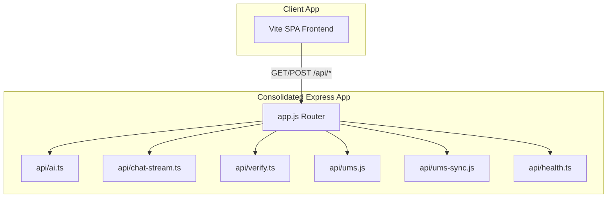

# HTTP Server Layer Analysis

This document outlines the current HTTP server architecture, endpoint configurations, routing pipelines, and the migration path for consolidating all Vercel Serverless Functions into a unified Express.js server.

---

## 🔍 Existing Server Configurations

Currently, the application supports two HTTP backend entry points:

### 1. Vercel Serverless Functions (`/api/*`)
- **Location**: All files inside the `/api` directory.
- **Runtime**: Node.js serverless environment.
- **Routing**: Automatically resolved by Vercel's folder structure (e.g., `/api/verify` maps to `/api/verify.ts`).
- **Signature**: Uses standard Node.js serverless request-response handlers:
  ```typescript
  export default async function handler(req: VercelRequest, res: VercelResponse) { ... }
  ```
- **Limitation**: Cannot run as a persistent, standalone node process on traditional containers/VMs (like Render) without a proxy wrapper.

### 2. Local Express Proxy Server (`server.js`)
- **Location**: [server.js](file:///c:/Users/hp/Desktop/AIPS%2025_26/APIS-Academic-Intelligence-System-main/server.js).
- **Runtime**: Local Node.js Express process.
- **Ports**: Listens on `process.env.PORT || 3001`.
- **Endpoints Mapped**:
  - `POST /api/ums-sync`: Dynamically imports [api/ums-sync.js](file:///c:/Users/hp/Desktop/AIPS%2025_26/APIS-Academic-Intelligence-System-main/api/ums-sync.js) and routes requests through it.
  - `GET /api/health`: Hardcoded status response.
  - `POST /api/ai`: Proxy route implementing custom Groq API requests.
  - `POST /api/chat-stream`: Proxy route implementing real-time streaming to Groq with manual SSE writer loops.
- **Endpoints Missing (Not Mapped)**:
  - `POST /api/verify`
  - `POST /api/chat`
  - `GET/POST /api/ums`
  - `/api/ums/fetch-assignments`
  - `/api/ums/fetch-attendance`
  - `/api/ums/fetch-marks`
  - `/api/ums/fetch-timetable`

---

## 🔄 Proposed Express Consolidation Route

To make the application fully compatible with traditional cloud hosting environments (like Render.com), we will consolidate all serverless routes under a unified Express.js foundation.



### Routing Strategy
1. **app.js**: Declare the core Express app, apply global middlewares (JSON parsing, CORS policies, logging), and register modular routes.
2. **api/ums Subrouter**: Mount nested endpoints under `/api/ums/` by importing files inside `/api/ums/` dynamically or statically.
3. **Request/Response Compatibility**: Express `req` and `res` are fully compatible with Vercel's `VercelRequest` and `VercelResponse` wrapper signatures. All serverless handlers can be invoked directly as Express route controllers without code modification.
